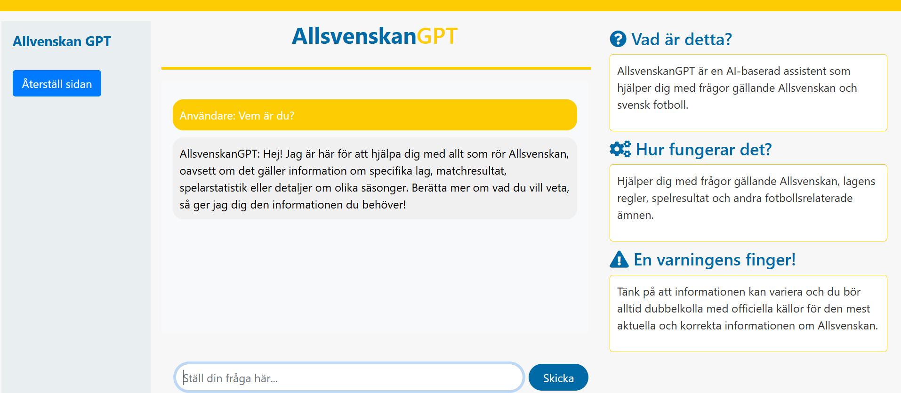

<!-- Improved compatibility of back to top link: See: https://github.com/othneildrew/Best-README-Template/pull/73 -->

<!--
*** Thanks for checking out the Best-README-Template. If you have a suggestion
*** that would make this better, please fork the repo and create a pull request
*** or simply open an issue with the tag "enhancement".
*** Don't forget to give the project a star!
*** Thanks again! Now go create something AMAZING! :D
-->

<!-- PROJECT SHIELDS -->
<!--
*** I'm using markdown "reference style" links for readability.
*** Reference links are enclosed in brackets [ ] instead of parentheses ( ).
*** See the bottom of this document for the declaration of the reference variables
*** for contributors-url, forks-url, etc. This is an optional, concise syntax you may use.
*** https://www.markdownguide.org/basic-syntax/#reference-style-links
-->

<!-- PROJECT LOGO -->
 

    

<h3 align="center">PatentGPT</h3>

<!-- ABOUT THE PROJECT -->
## About The Project

    
PatentGPT is an AI-powered assistant designed to assist with questions related to patents. This application offers a user-friendly interface where users can ask questions about patent applications, patent laws, and other patent-related topics.

    

### Features:
* **Interactive Chat Interface:** Users can type their queries and receive responses in real-time.
* **AI-Powered Responses:** The application uses AI to generate responses related to patents.
* **User-Friendly Design:** Built with a clean and intuitive design for ease of use.......-

(<a href="#readme-top">back to top</a>)

<!-- TECHNOLOGIES USED -->
## Technologies used
* [![Python][Python.com]][Python-url]
* [![Flask][Flask.com]][Flask-url]
* [![OpenAI][OpenAI.com]][OpenAI-url]
* [![HTML][HTML.com]][HTML-url]
* [![JavaScript][JavaScript.com]][JavaScript-url]
* [![CSS][CSS.com]][CSS-url]

(<a href="#readme-top">back to top</a>)

<!-- GETTING STARTED -->
## Getting Started

To run this project, you need the following software installed:

* Python 3.7 or higher
* Flask for creating the web application
* OpenAI Python package for interacting with the OpenAI API

### Breakdown:
- **Clone the Repository:** Instructions to clone the repo and navigate into the directory.
- **Create and Activate a Virtual Environment:** Setting up a virtual environment for dependency management.
- **Install the Required Packages:** Installing dependencies listed in `requirements.txt`.
- **Set Up Environment Variables:** Instructions to set up the OpenAI API key as an environment variable.
- **Run the Application:** Running the Flask app locally.
- **Access the Application:** Instructions to access the running application.
- **Running Tests:** Placeholder if you want to include test instructions.
- **Usage:** How to interact with the `/generate` endpoint.

This guide should help someone set up and run your Flask application smoothly.

(<a href="#readme-top">back to top</a>)

<!-- LICENSE -->
## License
Distributed under the MIT License.

(<a href="#readme-top">back to top</a>)

<!-- CONTACT -->
## Contact
Kerem Bjälvenäs Tazedal - kerem.tazedal.89@gmail.com

Project Link: [https://github.com/Kerem1989/patent-gpt](https://github.com/Kerem1989/patent-gpt)

(<a href="#readme-top">back to top</a>)

<!-- MARKDOWN LINKS & IMAGES -->
<!-- https://www.markdownguide.org/basic-syntax/#reference-style-links -->
[contributors-shield]: https://img.shields.io/github/contributors/othneildrew/Best-README-Template.svg?style=for-the-badge
[contributors-url]: https://github.com/othneildrew/Best-README-Template/graphs/contributors
[forks-shield]: https://img.shields.io/github/forks/othneildrew/Best-README-Template.svg?style=for-the-badge
[forks-url]: https://github.com/othneildrew/Best-README-Template/network/members
[stars-shield]: https://img.shields.io/github/stars/othneildrew/Best-README-Template.svg?style=for-the-badge
[stars-url]: https://github.com/othneildrew/Best-README-Template/stargazers
[issues-shield]: https://img.shields.io/github/issues/othneildrew/Best-README-Template.svg?style=for-the-badge
[issues-url]: https://github.com/othneildrew/Best-README-Template/issues
[license-shield]: https://img.shields.io/github/license/othneildrew/Best-README-Template.svg?style=for-the-badge
[license-url]: https://github.com/othneildrew/Best-README-Template/blob/master/LICENSE.txt
[linkedin-shield]: https://img.shields.io/badge/-LinkedIn-black.svg?style=for-the-badge&logo=linkedin&colorB=555
[linkedin-url]: https://linkedin.com/in/othneildrew
[product-screenshot]: images/screenshot.png
[Next.js]: https://img.shields.io/badge/next.js-000000?style=for-the-badge&logo=nextdotjs&logoColor=white
[Next-url]: https://nextjs.org/
[Python.com]: https://img.shields.io/badge/Python-3776AB?style=for-the-badge&logo=python&logoColor=white
[Python-url]: https://www.python.org/
[Flask.com]: https://img.shields.io/badge/Flask-000000?style=for-the-badge&logo=flask&logoColor=white
[Flask-url]: https://flask.palletsprojects.com/
[OpenAI.com]: https://img.shields.io/badge/OpenAI-000000?style=for-the-badge&logo=openai&logoColor=white
[OpenAI-url]: https://openai.com/
[HTML.com]: https://img.shields.io/badge/HTML-E34F26?style=for-the-badge&logo=html5&logoColor=white
[HTML-url]: https://developer.mozilla.org/en-US/docs/Web/HTML
[JavaScript.com]: https://img.shields.io/badge/JavaScript-F7DF1E?style=for-the-badge&logo=javascript&logoColor=black
[JavaScript-url]: https://developer.mozilla.org/en-US/docs/Web/JavaScript
[CSS.com]: https://img.shields.io/badge/CSS-1572B6?style=for-the-badge&logo=css3&logoColor=white
[CSS-url]: https://developer.mozilla.org/en-US/docs/Web/CSS
